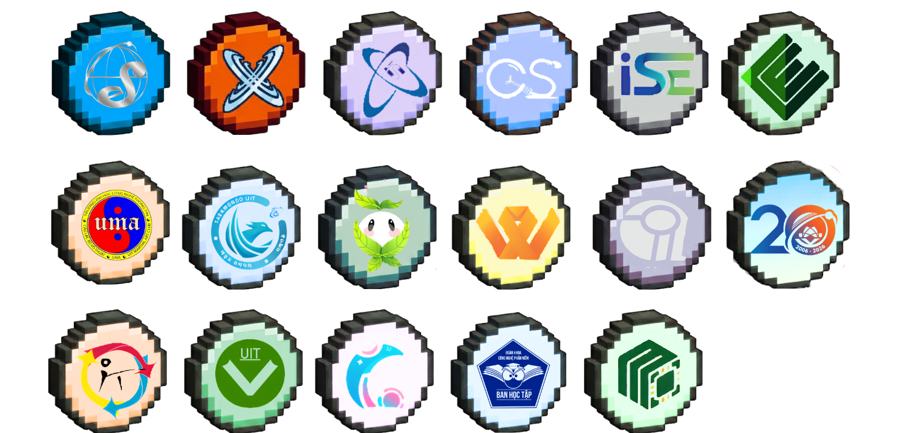
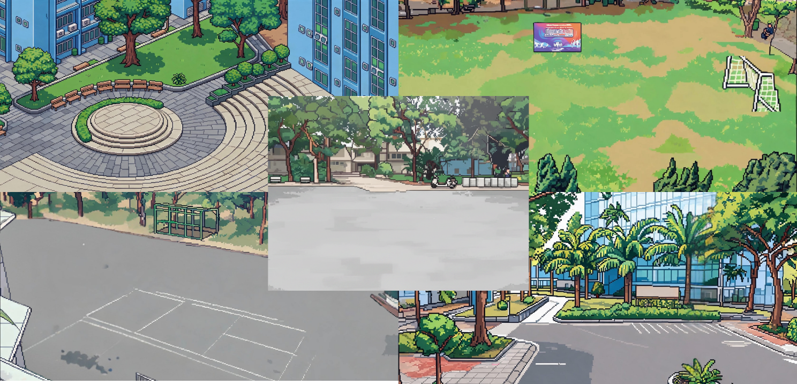

# 🎓 UIT: 20 Years, One Journey

**UIT: 20 Years, One Journey** là một trò chơi nhập vai (RPG) 2D Pixel Art được phát triển nhằm kỷ niệm **20 năm thành lập Trường Đại học Công nghệ Thông tin - ĐHQG HCM**. Người chơi sẽ vào vai một sinh viên, khám phá khuôn viên trường, tham gia các hoạt động từ các Khoa/CLB và tìm hiểu về một câu chuyện bí ẩn đằng sau ánh hào quang của buổi lễ kỷ niệm.

---


[](https://vpthanh.itch.io/uit-game-20-years)
[](https://drive.google.com/file/d/1UEkcQs5df5xN3pAZtFPjOVDIsR-Uk9Dh/view?usp=sharing)

---

## 🌟 Giới thiệu cốt truyện

Trong không khí náo nức của tuần lễ kỷ niệm 20 năm, bạn bắt đầu hành trình thu thập các **Sticker** từ các tổ chức trong trường.

---

## 🧍 Hệ thống NPC

NPC trong game được thiết kế theo phong cách sinh viên UIT với nhiều hoạt động khác nhau:

* 💬 Tương tác hội thoại
* 🎮 Giao nhiệm vụ
* 📖 Gợi ý cốt truyện
* ✨ Thay đổi nội dung theo tiến trình người chơi

Ngoài các NPC chính, game còn có nhiều NPC nền nhằm tái hiện không khí nhộn nhịp của trường đại học trong tuần lễ kỷ niệm.

---

## 🏅 Hệ thống UITBadge

UITBadge là hệ thống huy chương/sticker đặc biệt đại diện cho các Khoa, CLB và khu vực trong trường.

Người chơi cần:
- Hoàn thành nhiệm vụ
- Tham gia minigame
- Khám phá khu vực bí mật
- Tương tác với NPC

để thu thập đầy đủ bộ UITBadge.

Hệ thống này cũng đóng vai trò mở khóa:
- Hội thoại mới
- Nhiệm vụ mới
- Các phần cốt truyện đặc biệt

<p align="center">
  
</p>

---

## ✨ Tính năng nổi bật

* **📱 Hệ thống Smartphone:** Tích hợp Sticker Album, Bản đồ trường UIT, Cài đặt âm thanh và Hướng dẫn nút bấm.
* **💬 Hội thoại phân nhánh:** NPC có khả năng nhận diện người chơi, thay đổi nội dung thoại và giao nhiệm vụ dựa trên số sticker hiện có.
* **🎮 Kho Minigames đa dạng:** Bao gồm Quiz kiến thức, Memory Card (Lật hình), Clicker Game, và Catching Game.

---

## 🕹️ Cách chơi

* **Di chuyển:** Phím `W`, `A`, `S`, `D`.
* **Tương tác (NPC/Cửa/Vật phẩm):** Phím `E`.
* **Mở điện thoại:** Phím `Tab`.

### 🎯 Mục tiêu

Thu thập đủ 16 huy chương ẩn giấu tại các khu vực:

* 📍 Cổng A
* 📍 Tòa B
* 📍 Sân thư viện
* 📍 Sân bóng đá
* 📍 Nhà xe

Mỗi khu vực đều có:
- NPC riêng
- Minigame riêng
- Hội thoại và nhiệm vụ khác nhau

<p align="center">
  
</p>


---

## 🛠️ Công nghệ sử dụng

* **Unity 6:** C# Scripting với kiến trúc Component-based & ScriptableObjects.
* **DOTween:** Xử lý toàn bộ hiệu ứng UI, rung camera và lật bài 3D.
* **Dialogue Editor:** Hệ thống quản lý hội thoại Node-based.
* **Butler:** Tự động hóa quy trình Build & Deploy lên Itch.io.

---

## 📥 Cài đặt

1. **Clone repository:**

```bash
git clone https://github.com/hkha0801-sketch/Game-UIT20.git
```
